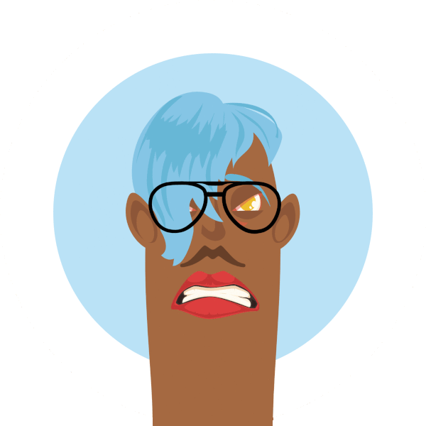

<p align="center" >
  
</p>

# Thumb Friends Fun avatars for everyone

Create your own thumb friend avatar by combining different facial expressions, there are millions of possible combinations.

## Demo

The app is live at [https://thumb-friends.netlify.app/](https://thumb-friends.netlify.app/)!

### Purpose

I've made this little project as a learning exercise to learn more about react, deployments and lambdas.

### Running the application

#### Install dependencies


```shell
yarn install
```

#### Install dependencies

Start the react application app will run on `http://localhost:3000`

```shell
yarn start
```

Start the netlify lambda/function will run on `http://localhost:9000`

```shell
yarn start:lambda
```

# License
I've released this little react app under MIT License. Feel free to tweak change or adapt to your likes. Attribution would be appreciated, but it's not mandatory.
